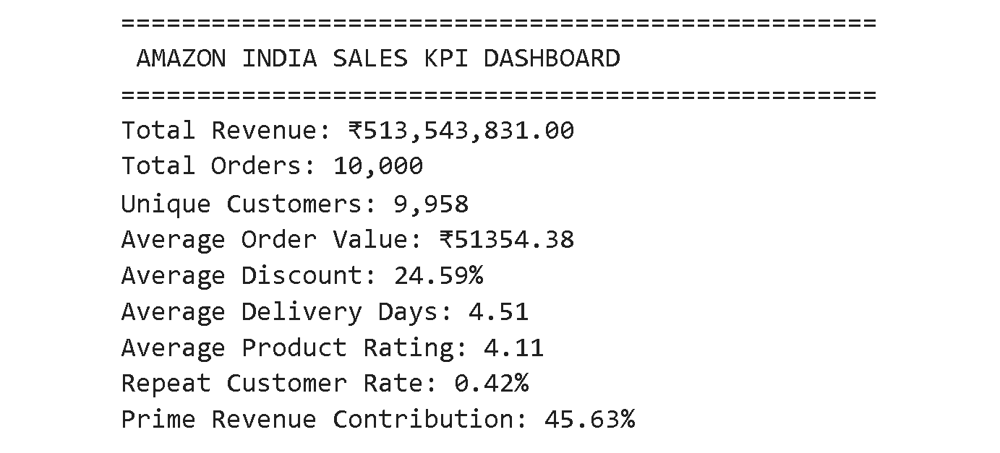
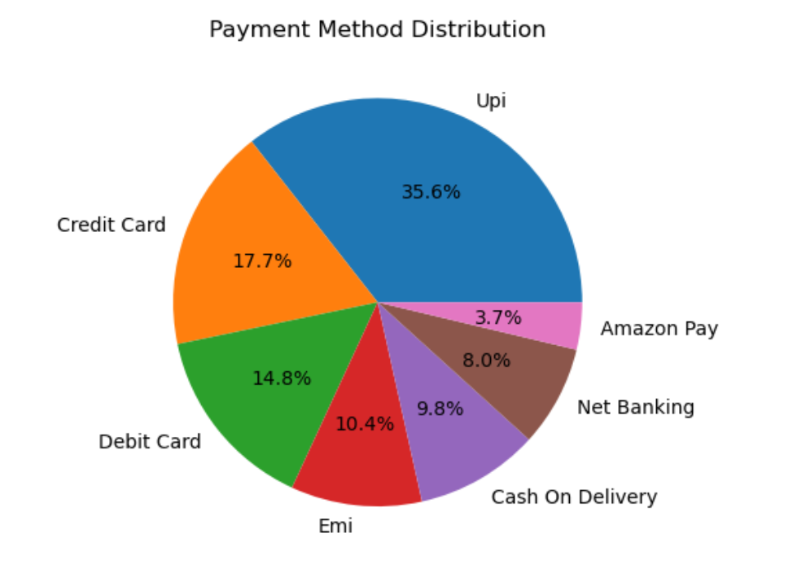
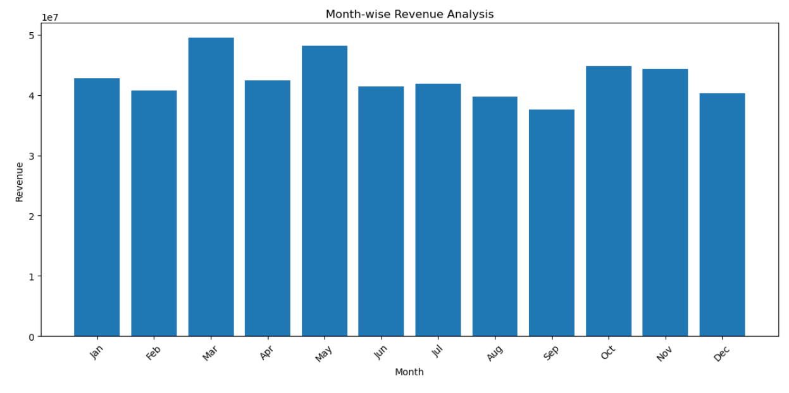
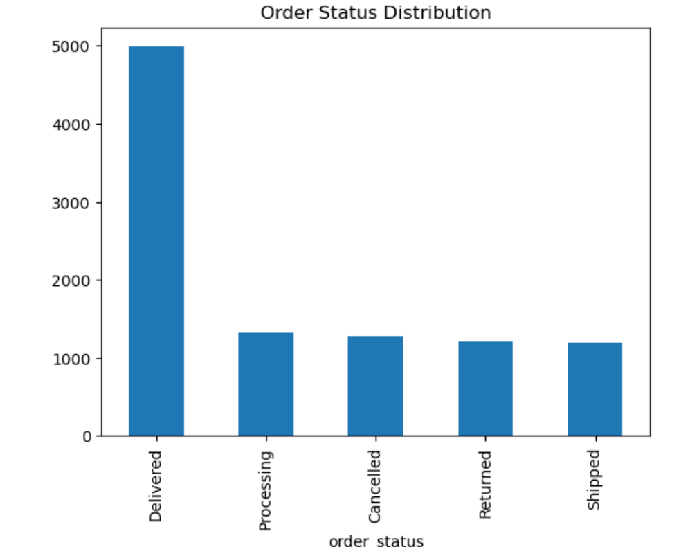

# 📊 Amazon Business Insights Analysis

## Exploratory Data Analysis of Amazon India Transactional Data using Python


---

# 📌 Project Overview

This project presents a comprehensive exploratory data analysis of Amazon India transactional data to uncover business performance patterns, customer behavior trends, payment preferences, operational efficiency, and revenue insights.

The analysis converts raw e-commerce transaction records into meaningful business intelligence using Python-based analytical workflows.

---

# 🎯 Project Objectives

- Analyze revenue trends across months
- Evaluate payment method preferences
- Measure operational efficiency
- Identify customer behavior patterns
- Assess Prime membership contribution
- Generate actionable business recommendations

---

# 🛠️ Tech Stack

- Python
- Pandas
- NumPy
- Matplotlib
- Seaborn
- Jupyter Notebook

---

# 📂 Repository Structure

```bash
amazon-business-insights/
│
├── dataset.csv
├── amazon_analysis.ipynb
├── amazon_analysis_report.pdf
├── README.md
├── monthly_revenue.png
├── kpi_dashboard.png
├── payment_distribution.png
└── order_status.png
```

---

# 📈 Key Performance Metrics

| KPI | Value |
|-----|------|
| Total Revenue | ₹513,543,831 |
| Total Orders | 10,000 |
| Unique Customers | 9,958 |
| Average Order Value | ₹51,354.38 |
| Average Discount | 24.59% |
| Average Delivery Days | 4.51 |
| Average Product Rating | 4.11 |
| Repeat Customer Rate | 0.42% |
| Prime Revenue Contribution | 45.63% |

---

# 📊 Visual Insights & Analysis

---

## 1️⃣ KPI Dashboard Analysis



### Key Insights

- Revenue exceeded **₹513M**
- Prime customers contributed **45.63%**
- Product rating remained strong at **4.11**
- Average delivery turnaround was **4.51 days**
- Average order value stood at **₹51,354**

### Business Interpretation

The platform demonstrates strong financial performance with healthy operational efficiency.

The **45.63% Prime contribution** indicates that subscription-based customers are a major revenue driver.

### Recommendation

Strengthen Prime membership campaigns to increase recurring high-value customer engagement.

---

## 2️⃣ Payment Method Distribution Analysis



### Payment Share Breakdown

| Method | Share |
|-------|------|
| UPI | 35.6% |
| Credit Card | 17.7% |
| Debit Card | 14.8% |
| EMI | 10.4% |
| Cash on Delivery | 9.8% |
| Net Banking | 8.0% |
| Amazon Pay | 3.7% |

### Key Insights

- UPI dominates transaction preferences
- Card-based payments contribute significantly
- Amazon Pay shows low platform wallet adoption

### Business Interpretation

Digital-first payment behavior dominates the ecosystem.

### Recommendation

Introduce cashback rewards to increase Amazon Pay usage.

---

## 3️⃣ Month-wise Revenue Analysis



### Key Insights

- **March** recorded peak revenue
- **May, October, and November** also performed strongly
- **September** showed the lowest monthly revenue

### Business Interpretation

Revenue patterns indicate strong seasonal fluctuations likely influenced by shopping events and promotional campaigns.

### Recommendation

Target weaker months with strategic discount campaigns.

---

## 4️⃣ Order Status Distribution Analysis



### Key Insights

- Delivered orders dominate overall transactions
- Processing volume remains moderate
- Cancellation and return rates suggest optimization opportunities

### Business Interpretation

Operational efficiency is strong, but order failures reveal room for fulfillment improvements.

### Recommendation

Optimize logistics and reduce cancellation triggers.

---

# 🔍 Overall Business Insights

This analysis reveals:

✔ Strong annual revenue generation  
✔ High digital payment adoption  
✔ Stable customer transaction volume  
✔ Significant Prime member contribution  
✔ Efficient order fulfillment performance

---

# 💡 Strategic Recommendations

- Increase Prime member retention
- Promote Amazon Pay incentives
- Improve delivery accuracy
- Optimize promotional timing
- Reduce cancellation rates

---

# 📄 Project Deliverables

### Jupyter Notebook
Contains:

- Data Cleaning
- Data Preprocessing
- Exploratory Analysis
- Visualization

### PDF Report
Includes:

- Detailed findings
- Statistical observations
- Business recommendations

---

# 🚀 Future Scope

Potential project extensions:

- Power BI dashboard
- Predictive revenue forecasting
- Customer segmentation analysis
- Machine learning models

---

# 👨‍💻 Author

**UMA RAI**  
Aspiring Data Analyst

---

# ⭐ Skills Demonstrated

- Exploratory Data Analysis
- Data Cleaning
- Visualization
- Business Analytics
- Analytical Storytelling

---

## ⭐ If you found this project useful, consider starring this repository.
